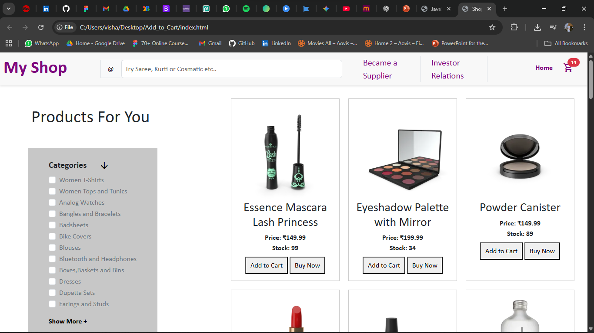
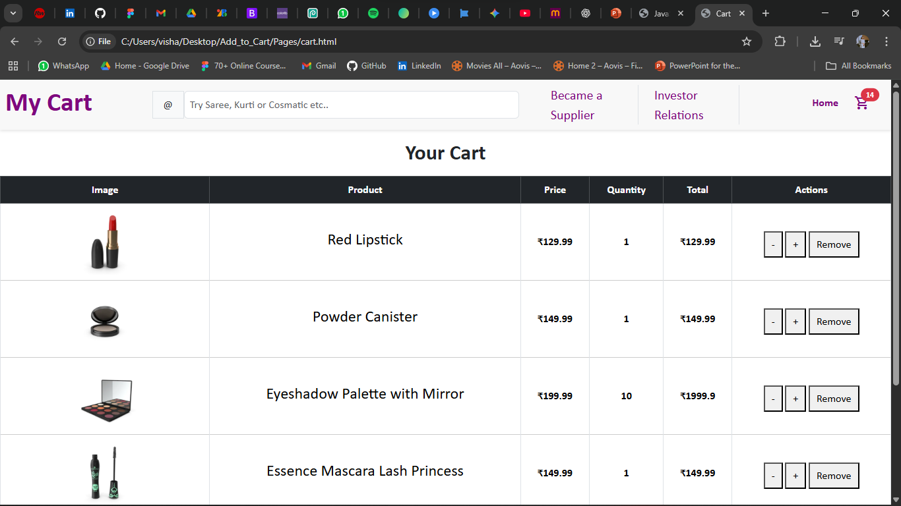

# 🛍️ My Shop – Add to Cart Web Application

A simple and elegant **Add to Cart** web app built using **HTML, CSS, and JavaScript**.  
This project simulates a shopping experience where users can browse products, add them to the cart, and manage their orders with real-time updates.

---

## 📸 Screenshots

### 🏠 Homepage
Displays available products with options to **Add to Cart** or **Buy Now**.  
Each product shows its name, price, and stock availability.



### 🛒 Cart Page
Shows a detailed view of all selected products with:
- Product image, name, price, and quantity
- Dynamic total calculation
- Buttons to **increase**, **decrease**, or **remove** items  
- Automatically updated total price



---

## ✨ Features

✅ Product listing with prices and stock count  
✅ “Add to Cart” and “Buy Now” buttons for each product  
✅ Real-time cart updates and total price calculation  
✅ Quantity management (+ / - buttons)  
✅ Option to remove items from cart  
✅ LocalStorage integration (optional – if implemented)  
✅ Responsive design with clean layout  

---

## 🛠️ Technologies Used

- **HTML5** – Structure and layout  
- **CSS3** – Styling and design  
- **JavaScript (ES6)** – Functionality and interactivity  

---

## 📂 Project Structure

```
Add_to_Cart/
│
├── index.html              # Homepage (product listing)
├── Pages/
│   └── cart.html           # Shopping cart page
├── CSS/
│   └── style.css           # Styling for the pages
├── JS/
│   └── script.js           # Handles cart logic (add, remove, update)
├── Images/                 # Product images
└── README.md               # Project documentation
```

---

## 🚀 How to Run

1. **Download** or **clone** the project:
   ```bash
   git clone https://github.com/vaishalivala17/Add_to_Cart.git
   ```

2. Open the folder in your code editor (like VS Code).

3. Run the app by opening `index.html` in your browser:
   ```
   file:///C:/Users/visha/Desktop/Add_to_Cart/index.html
   ```

---

## 💡 Future Improvements

- Add user login / registration  
- Implement checkout and payment gateway  
- Connect to a real product database  
- Improve mobile responsiveness  

---
